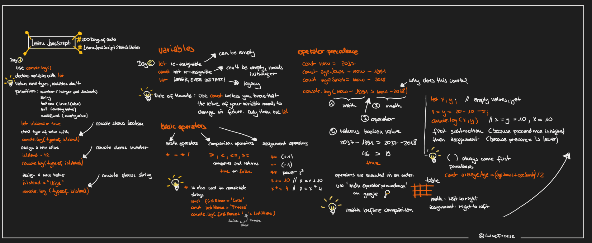
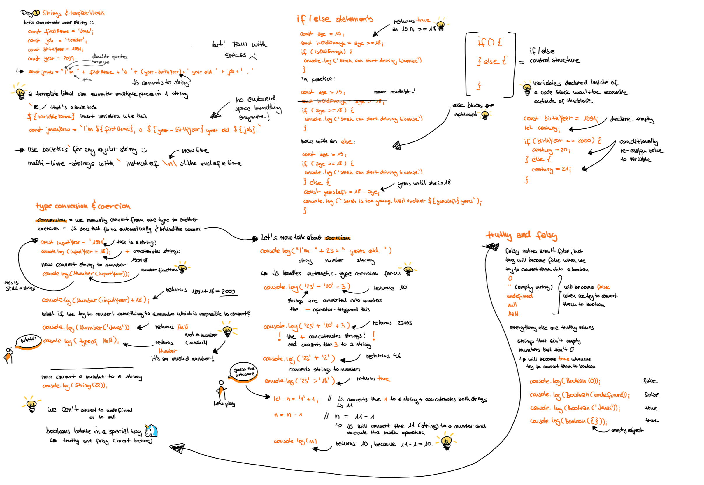

# Learn-JavaScript-Sketchnotes

Started my #100DaysOfCode on August 19, 2021 and want to learn JavaScript. I am following this course: [The Complete JavaScript Course 2021: From Zero to Expert](https://www.udemy.com/course/the-complete-javascript-course/) and will document my learning progress with my sketchnotes.

You can [follow me on twitter](https://twitter.com/LuiseFreese) to get each day a sketchnote of my journey in your feed :-) - I will use #100DaysofCode and #LearnJavaScriptSketchNotes.
I will provide both a still image as `.png` and an animated `.gif`.

## Day 1 and Day 2

## Day 3

## Day 4

